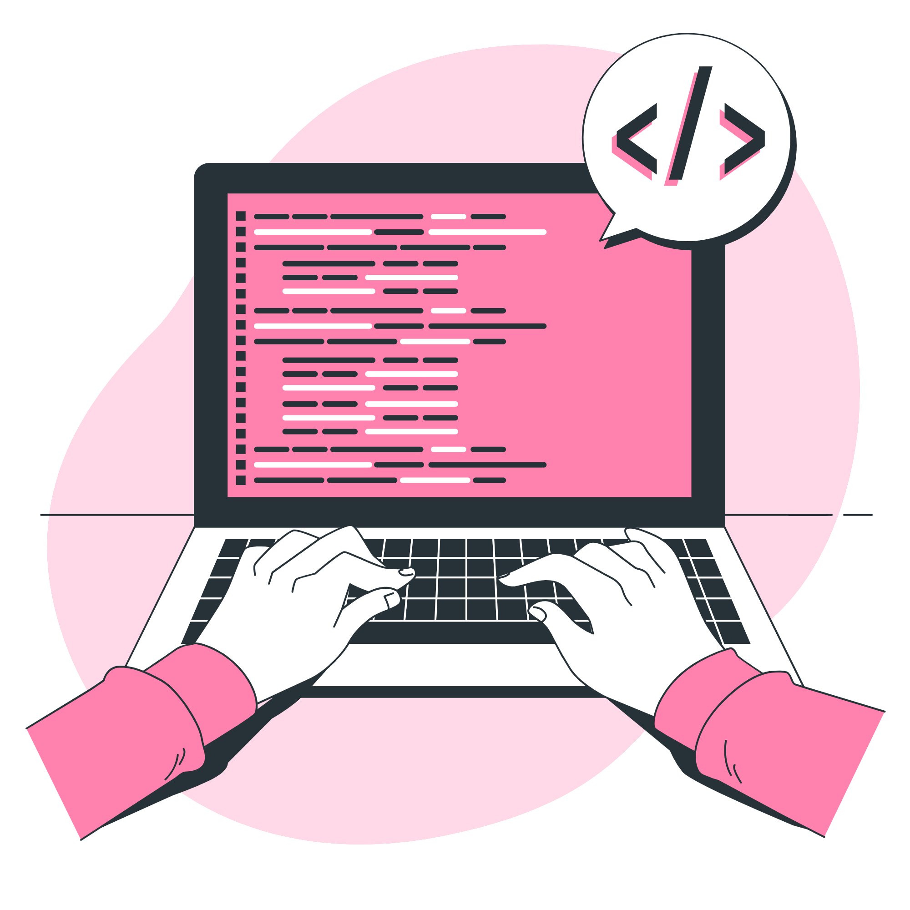

# Hello, World! 👋

  My name is **Lais**, I am 29 years old, and my stack is **Ruby on Rails**.
   
  I am trained by CampusCode, in the **TreinaDev** program, and I work as a **FullStack Developer** at **Pitzi**.

### 💻 Skills

  
 Development Methodologies 

  - SCRUM
  - Extreme Programming

  > #### Concepts
  > - Programming Logic
  > - Object-Oriented Programming
  > - Best Practices

  > #### Practices
  > - Test-Driven Development (TDD)
  > - Pair Programming
  > - Code Standardization
  > - Code Reviews
  > - CI/CD

  
 Languages 

  - Ruby
  - JavaScript
  - Java
  - C/C++
  - PHP

  > #### Back-End
  > - Ruby on Rails 
  > - API RESTful

  > #### Front-End
  > - HTML5
  > - CSS3
  > - BootStrap
  > - Tailwind CSS
  > - Vue JS

  > #### Databases
  > - SQL
  > - SQLite3
  > - PostgreSQL

  > #### Testing tools
  > - RSpec
  > - Capybara

  
 Other Tools
 

  - RuboCop
  - Figma
  - AWS
  - Jenkins

  > #### Operating Systems
  > - Windows / WSL
  > - Ubuntu

  > #### Containers
  > - Docker

  > #### Version Control
  > - Git
  > - GitHub
  > - GitHub Actions

### 💬 Contact

