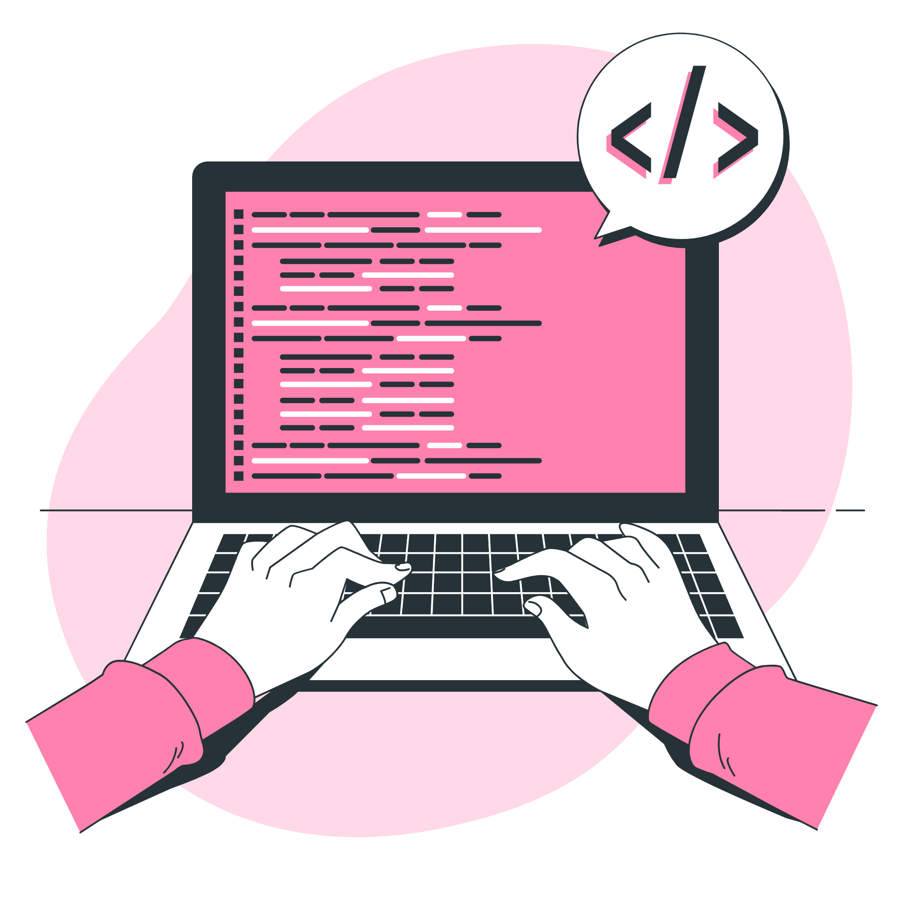

# Olá, Mundo! 👋

  Meu nome é **Lais**, tenho 29 anos, e minha stack é **Ruby on Rails**.
   
  Sou formada pela CampusCode no programa **TreinaDev12** da CampusCode, e trabalho como **Desenvolvedora FullStack** 
  na **Pitzi**.

### 💻 Habilidades

  
 Metodologias de Desenvolvimento 
 

  - SCRUM
  - Extreme Programming

  > #### Conceitos
  > - Lógica de Programação
  > - Orientação a Objetos
  > - Boas Práticas

  > #### Práticas
  > - Desenvolvimento Orientado a Testes (TDD)
  > - Programação Pareada
  > - Padronização de Código
  > - Code Reviews

  
 Linguagens 

- Ruby
- JavaScript
- Java
- C/C++
- PHP

> #### Back-End
> - Ruby on Rails
> - API RESTful

> #### Front-End
> - HTML5
> - CSS3
> - BootStrap
> - Tailwind CSS
> - Vue JS

> #### Banco de Dados
> - SQL
> - SQLite3
> - PostgreSQL

> #### Ferramenta de Testes
> - RSpec
> - Capybara

  
 Outras Ferramentas
 

- RuboCop
- Figma
- AWS
- Jenkins

> #### Sistemas Operacionais
> - Windows / WSL
> - Ubuntu

> #### Containers
> - Docker

> #### Versionamento de Código
> - Git
> - GitHub
> - GitHub Actions

### 💬 Contato

